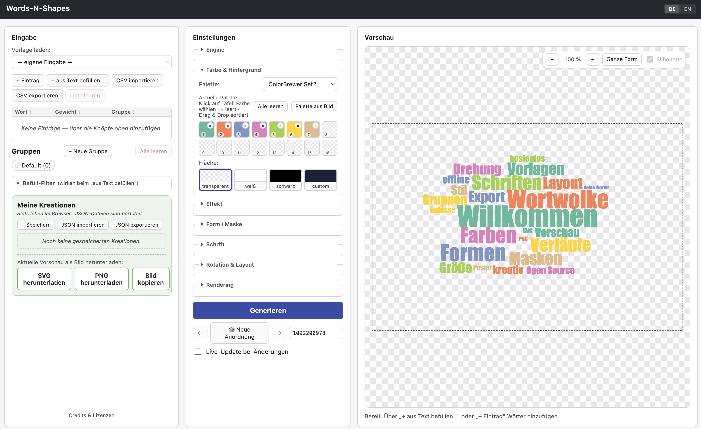

# Words-N-Shapes

> Word clouds in predefined or custom silhouettes — offline, in a single HTML file.

🇩🇪 Deutsch: [LIESMICH.md](LIESMICH.md)

**[▶ Live demo](https://docatprompt.github.io/words-n-shapes/)** · A self-contained HTML tool for creating word clouds with SVG and PNG export (with transparency). Runs entirely offline in the browser — no installation, no build tools at runtime, no network calls (except the optional Google-Fonts opt-in).



## Try it

- **Online:** open the **[live demo](https://docatprompt.github.io/words-n-shapes/)** — nothing to install.
- **Offline:** grab the prebuilt **[`dist/wordcloud.html`](dist/wordcloud.html)** (or the asset on the [latest release](https://github.com/DocAtPrompt/words-n-shapes/releases/latest)) and **double-click it** — it opens in your default browser and works fully offline. It is one self-contained file, so you can also host it anywhere yourself.

---

## Background — why two engines?

Word-cloud packing is a hard layout problem, and no single open-source engine is best at everything. Words-N-Shapes therefore ships **two**, switchable in the UI behind a shared engine interface, so you can pick the right trade-off per job:

| | **d3-cloud** (default) | **wordcloud2.js** |
|---|---|---|
| Output | **SVG** (vector) | Canvas (raster) |
| Best for | crisp print/vector export, editing | organic look, certain shapes |
| Spiral | archimedean / rectangular | grid-based |
| **SVG export** | ✅ yes | ❌ no (canvas only) |
| **Per-word editing** (select, colour, move/pin, rotate, reflow) | ✅ yes (live, vector) | ❌ no (pixels are baked) |
| Effects (shadow / glow) | ✅ SVG filters | ❌ |
| Native analytic shapes | — | ✅ for 6 slugs (circle, diamond, triangle, triangle-forward, star, pentagon) |

**Rule of thumb:** use **d3-cloud** when you want a clean vector result, SVG export, or want to fine-tune individual words; switch to **wordcloud2.js** when you prefer its denser canvas look or one of its native analytic shapes. Both honour the same inputs (words, groups, colours, fonts, masks, render size), so you can try one, then the other, without redoing your setup.

Everything runs **client-side in a single file**: the goal is a tool you can keep, archive, e-mail, or host yourself, that will still work years from now with no server, account, or build step.

---

## Features

- **Two engines** (see above), switched in the UI; the app abstracts both behind one interface.
- **Input**: a central table (`word | weight | group`); a "fill from text" dialog with tokenization and stop-word filtering (DE ~450 / EN ~350, plus custom stop words, min frequency, min length); RFC-4180 CSV import/export with error-line reporting.
- **Templates**: 10 themes (mixed DE+EN), one per JSON file; loading a theme creates a matching word group.
- **Groups**: per-group colour (auto / single / gradient), font, rotation, size factor (0.5–2.0×) and padding bonus (d3-cloud only).
- **Fonts**: 8 system fonts + 17 inlined web fonts + an optional Google-Fonts loader (FontFace API; the only feature that touches the network, and only when you enable it).
- **Colour**: 21 palettes; an always-visible 16-slot swatch editor (drag & drop, click to pick, × to clear); "palette from image"; a global gradient with an optional via-stop; per-group gradients.
- **Background, two layers**: **Canvas** (the whole render area) and **Mask** (inside the active shape), each transparent / white / black / custom.
- **Rotation**: 12 presets in 5 groups (horizontal only / slanted or vertical / symmetric / discrete steps / free angles) + distribution (random / heaviest / lightest) + a share slider.
- **Shape / Mask**: 24 built-in masks + your own **SVG or PNG/JPG** upload (see [Custom masks](#custom-masks--where-to-get-them)). Aspect-preserving letterbox fit; the preview shows the mask outline as a dashed silhouette.
- **Effects** (d3-cloud only): drop **shadow** or **glow**, with colour and strength.
- **Per-word editing** (d3-cloud only) — select a word in the preview and:
  - change its **colour** (overrides the palette; "Auto" resets);
  - **move / pin** it (drag, or arrow-key nudge — pinning anchors it so the rest can flow around it);
  - **rotate** it (slider, −180…180°);
  - **multi-select** with Cmd/Ctrl-click (e.g. recolour several at once);
  - press **"Arrange"** to reflow the free words around your pinned/rotated ones (same seed).
- **Preview tools**: zoom (buttons + mouse wheel, cursor-centred), pan (drag), "Fit shape", and a silhouette toggle. Collapsible settings sections (with a brief fold animation on start) keep the panel compact on smaller screens.
- **Reroll / seed history**: ← / → around the reroll button + Cmd/Ctrl+Z / Shift+Z (session-only).
- **Render size**: standard presets (3:2, Full HD, A4 portrait/landscape) + social-media presets (Instagram, Story/Reel, Pinterest, Facebook/LinkedIn, YouTube) + custom; font sizes scale with the format.
- **Export**: **SVG** (d3-cloud only) and **PNG** with transparency (1× / 2× / 4×); "copy image" where the browser allows it.
- **Storage**: named localStorage slots with auto-resume + JSON export/import (portable save files).
- **i18n**: DE / EN, auto-detected from the system language.

---

## User guide

Open the app (live demo or `dist/wordcloud.html`). On first start a small demo cloud appears; it disappears as soon as you interact. The window has three columns: **Input** (left), **Settings** (middle), **Preview** (right).

### 1. Get words in

- Type or paste into the table, or use **"Fill from text"** to paste prose — it tokenizes, drops stop words, and counts frequencies into weights.
- Or **import a CSV** (`word,weight,group`). Export works the same way.
- **Groups** let you give sets of words their own colour / font / rotation. Loading a **template** creates a group automatically.

### 2. Style it (Settings panel)

The middle panel's sections collapse/expand by clicking their headings (click a heading to toggle). From top to bottom:

- **Engine** — d3-cloud or wordcloud2 (see [why two engines](#background--why-two-engines)).
- **Colour & background** — palette / gradient, the swatch editor, and the Canvas/Mask background layers.
- **Effect** — none / shadow / glow (d3-cloud).
- **Shape / Mask** — none, a built-in shape, or your own upload.
- **Font** — font, size scaling, min/max px, Google-Fonts opt-in.
- **Rotation & layout** — rotation mode, share, distribution, padding.
- **Rendering** — output size preset / custom dimensions, PNG resolution.

### 3. Generate & refine

- Click **"Generate"** (or enable **Live update** for automatic re-renders).
- **🎲 Reroll** gives a new arrangement; ← / → step through previous seeds.
- **Zoom / pan** the preview to inspect; **"Fit shape"** recentres.

### 4. Fine-tune individual words (d3-cloud)

Click a word in the preview to select it (a frame appears and a small edit bar docks under the zoom toolbar):

- Pick a **colour**, or **Auto** to return to the palette.
- **Drag** the word, or nudge it with the **arrow keys** — this **pins** it.
- Use the **rotation** slider to angle it.
- Cmd/Ctrl-click more words to **multi-select**.
- Click the empty canvas (or press Esc) to deselect.
- When something is pinned/rotated, an **"Arrange"** button appears (left of the zoom tools): click it to reflow the free words around your fixed ones.

### 5. Export & save

- **Download SVG** (d3-cloud) or **Download PNG** (choose 1× / 2× / 4× for resolution).
- **Save** your setup to a named slot (lives in the browser) or **export JSON** for a portable file you can re-import later.

> **Tip — filling the shape.** How well words fill a shape depends on their number, lengths and the size range (min/max px). It is intentionally manual so you keep control of the look.
> - **Not all words fit** ("N of M placed")? → lower the max size, use fewer/shorter words, a larger format, or wordcloud2's "shrink to fit".
> - **Shape stays too empty**? → raise min/max size, add words, or use a smaller format.

---

## Custom masks — where to get them

Beyond the 24 built-in shapes you can load **your own mask** (Shape / Mask → "own SVG", or a PNG/JPG):

- **Use a FILLED icon, not an outline.** A mask works by its *solid area*; outline-only icons have almost no fill and won't carry the cloud. The preview shows immediately whether the shape holds.
- **SVG** (max ~100 KB): paste the markup or pick a file. On most icon sites: open a filled icon → "Copy SVG" → paste it in.
- **PNG / JPG**: a filled, high-contrast motif works best — a light area is treated as *outside*. Photos/scans are separated by brightness; if it comes out inverted, tick **"Invert"**.

**Good sources for filled icons** (the upload panel links these too):

| Source | Pick |
|---|---|
| [Phosphor Icons](https://phosphoricons.com/) | the **fill** weight |
| [Font Awesome](https://fontawesome.com/search?o=r&s=solid&f=classic) | **solid** style |
| [Material Symbols](https://fonts.google.com/icons) | **filled** |
| [Heroicons](https://heroicons.com/) | **solid** |
| [SVG Repo](https://www.svgrepo.com/) | filled silhouettes |

> ⚠️ **Licensing of your own masks is your responsibility.** Icons you load from third-party libraries remain under the licence of their source. The 24 **built-in** masks are own work, released into the public domain (CC0-equivalent), and carry no such restriction.

---

## Build

The prebuilt `dist/wordcloud.html` is committed, so you don't need to build to use the app. To rebuild from source:

```sh
./build.sh
```

It concatenates the template, CSS, stop-word lists, theme/palette JSON, base64-inlined fonts, the vendor libraries and the app code into a single `dist/wordcloud.html`.

## Project layout

```
.
├── wordcloud.template.html   HTML skeleton with placeholders
├── build.sh                  build script
├── src/
│   ├── app.js                app logic
│   ├── styles.css            UI styles
│   ├── stopwords-de.js       German stop-word list (~450)
│   └── stopwords-en.js       English stop-word list (~350)
├── vendor/
│   ├── d3-dispatch.min.js    d3-dispatch v1.0.6
│   ├── d3-cloud.js           d3-cloud v1.2.9 (patched — see below)
│   └── wordcloud2.min.js     wordcloud2.js v1.2.3 (patched — see below)
├── data/                     10 theme templates + 21 palettes (JSON)
├── assets/fonts/             17 inlined web fonts (woff2)
├── assets/masks/             24 mask SVGs
├── docs/vendor-patches/      upstream diffs + notes for the two patches
├── LICENSES/                 third-party + font license texts
└── dist/wordcloud.html       result (self-contained)
```

*(Internal design docs — specs, plans, working notes — are kept out of this repository on purpose; everything needed to use and rebuild the app is here.)*

## Licenses

This project is released under the **MIT License** (see [`LICENSE`](LICENSE)).

Embedded third-party software and fonts keep their own licenses (full texts under `LICENSES/`):

| Library / Font | Version | License |
|---|---|---|
| d3-dispatch | 1.0.6 | BSD-3-Clause (© 2010–2019 Mike Bostock) |
| d3-cloud | 1.2.9 | BSD-3-Clause (© 2013 Jason Davies) — locally modified, see below |
| wordcloud2.js | 1.2.3 | MIT (© 2011–2019 Timothy Chien) — locally modified, see below |
| 14 web fonts | see `LICENSES/fonts/` | SIL Open Font License 1.1 |
| 3 web fonts (Permanent Marker, Special Elite, Roboto Slab) | see `LICENSES/fonts/` | Apache License 2.0 |
| 24 mask SVGs (own work) | — | Public Domain (CC0-equivalent) |

### Local modifications to vendored libraries

Two vendored libraries are modified locally. Both upstream licenses (BSD-3-Clause and MIT) permit modification and redistribution; the changes are disclosed here for transparency, provided as `.patch` diffs under `docs/vendor-patches/`, and marked inline in the source with `// PATCH (...)` comments.

**`vendor/d3-cloud.js`** (d3-cloud 1.2.9) — see [`docs/vendor-patches/d3-cloud-mask.patch`](docs/vendor-patches/d3-cloud-mask.patch):
1. **Mask setter** — a new `cloud.mask(canvas)` accepts a mask canvas (pixel alpha > 128 = blocked, ≤ 128 = free). d3-cloud has no native mask API.
2. **Board pre-fill** — before the first word is placed, the private `board` bit-array is pre-marked from the mask, so words flow around the shape.
3. **Bounds relaxation for multi-region masks** — with a mask active, placement no longer requires each word to overlap the bounding box of already-placed words. Without this, the cloud grows as one blob and fills only the region where the first word lands; with it, all separate regions of a multi-part shape fill.
4. **`cloud.pinned([...])`** — pre-places user-pinned words (per-word editing) into the collision board before the spiral layout runs, using the same bit-logic as normal placement minus the collision check. This anchors moved/rotated words so the rest reflow around them.

**`vendor/wordcloud2.min.js`** (wordcloud2.js 1.2.3) — see [`docs/vendor-patches/wordcloud2-seed.patch`](docs/vendor-patches/wordcloud2-seed.patch): an injectable `random` function replaces the internal `Math.random()` calls so layouts are reproducible from a seed (reroll / undo-redo). Without it, "change only the colours" would reshuffle the layout.

When updating either library, re-apply the patches: fetch the upstream original, then `patch -p1 < <file>.patch` from the repo root (or re-insert the `// PATCH (...)`-marked blocks by hand).

---

Built with the help of Anthropic Claude (Claude Code).
